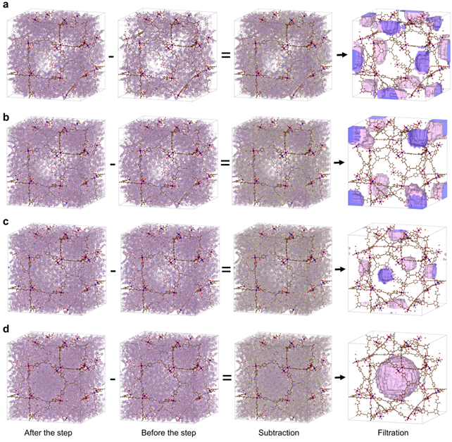

# A Code for Studying Pore Filling Mechanisms in Adsorption Processes

This repository provides a Python code developed for the visualization and study of pore filling mechanisms in adsorption processes. It focuses on understanding how gas adsorbate molecules occupy pores within adsorbent frameworks when simulated using Grand Canonical Monte Carlo (GCMC) calculations.

## Purpose
The code generates cube files representing density maps of regions filled between two pressure points along a simulated adsorption isotherm. These files can then be visualized with external software packages such as VESTA, GaussView, and similar programs. This approach allows a clearer understanding of the contribution of each pore in complex porous frameworks during the stepwise adsorption process observed in the isotherm.

## Reference
For a detailed explanation of the method and applications, please refer to the following publication:
[https://chemrxiv.org/engage/chemrxiv/article-details/68cef31e3e708a764963d3a9]

## Example
An illustrative case is the study of pore filling mechanisms in argon (Ar) adsorption into the CU-6-Cr MOF.

Below is an example visualization generated using VESTA visualisation tools:

# 

## Citation
If you use this code in your research, please kindly consider citing the following:  
[https://chemrxiv.org/engage/chemrxiv/article-details/68cef31e3e708a764963d3a9]
